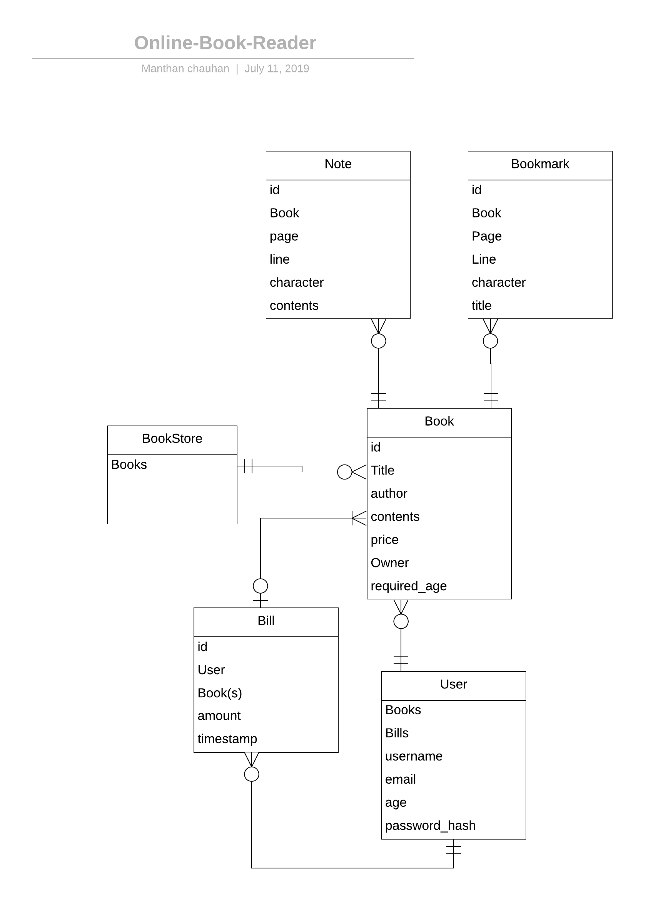

## Introduction
Creating the design of an Online Book Reader System (OBR).
## Functionalities
1. The OBR has an online store, from which users can purchase books.
2. User can search books on the basis of title or author.
2. Each book bought is stored in the user's personal library.
3. Each transaction is recorded in user's account.
4. User can return a book provided he did not opened the book.
3. User can upload book manually in his personal library.
4. User can read a book's contents.
5. User can highlight a books's contents.
6. User can create Notes and Bookmarks in the book.
## Objects
1. BookStore
2. Book
3. User
4. Bill
5. Note
6. Bookmark
## Database 
Used PostgreSQL.  

